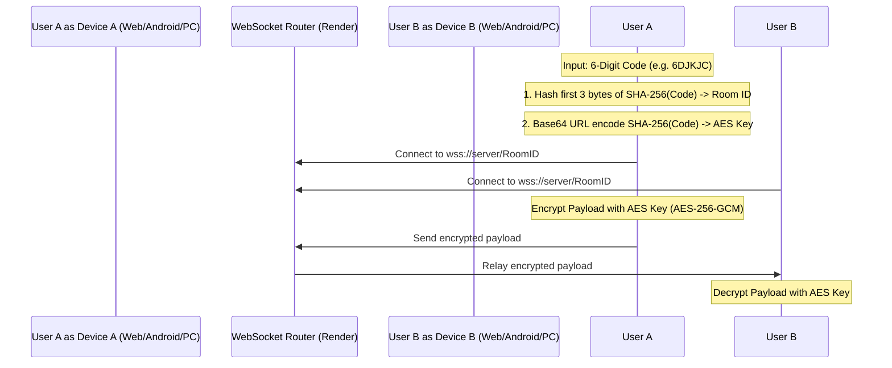

# ChaT — Zero-Knowledge End-to-End Encrypted (E2EE) Chat Space

ChaT is a lightweight, modern, and zero-knowledge room-based chat application that enables secure, temporary communication. All message encryption and decryption are processed entirely client-side, meaning that the relay server has absolutely no knowledge of your room keys, nicknames, message content, or shared files.

---

## 🚀 Key Features

* **Multi-Platform Suite**: Web Client (PWA), Native Android Client (Jetpack Compose), and Native Windows 11 Desktop Client (Compose Multiplatform).
* **AES-256-GCM Encryption**: Secure, modern encryption handled strictly on your local device.
* **6-Digit Room Codes**: Simple 6-character room codes are used to derive room IDs and E2EE secret keys locally. No passwords or accounts required.
* **E2EE File Sharing**: Encrypted transfer of photos, videos, audio notes, and general files (up to 15MB).
* **Direct Local Downloads**: Received media can be saved directly to the device's native `Downloads` directory (Android, PC, and Web).
* **QR Code Scan-to-Join**: Instantly display a room's QR Code or scan one using the camera to enter rooms.
* **Admin Control**: The room creator can instantly terminate the room, disconnecting all participants and destroying the room context.
* **Custom Nicknames**: Pick a dynamic alias when entering or automatically fall back to an anonymous tag (`Anon-XXXX`).

---

## 📂 Repository Layout

```text
├── android/            # Native Android Client (Kotlin & Jetpack Compose)
├── desktop/            # Native Windows 11 Client (Compose Multiplatform)
├── web/                # Desktop/Mobile Web Client (HTML, CSS, Vanilla JS PWA)
├── backend/            # WebSockets relay router (Python)
└── .github/workflows/  # Automated Android build pipelines
```

---

## 📲 How to Download & Install

### Android Client (Mobile)
1. Open your web browser and go to your GitHub repository's **Actions** tab:
   `https://github.com/Tejas7695-del/ChaT/actions`
2. Click on the latest successful build run (e.g., "Android CI").
3. Scroll down to the **Artifacts** section at the bottom of the page.
4. Download the **`app-debug.apk`** zip file, extract it, and transfer the `.apk` file to your Android phone.
5. On your phone, open the `.apk` file and tap **Install** (allow installation from "Unknown Sources" if prompted by your system).

### Windows 11 Client (Desktop)
1. Open the **`desktop`** folder in Android Studio.
2. From the run configuration dropdown at the top toolbar, select **`desktop [packageDistributionForCurrentOS]`**.
3. Click the green **Play (Run) `▶`** button.
4. Once the build completes, open Windows File Explorer and navigate to:
   `desktop/build/compose/binaries/main/exe/`
5. Double-click **`ChaT-1.0.0.exe`** to install the standalone app natively on Windows 11! A shortcut named **ChaT Installer** will also be created on your Desktop.

---

## 🛠️ Getting Started (For Developers)

### 1. Web Client
1. Navigate to the `web/` folder.
2. Open `index.html` in any modern browser.
3. To install it as a desktop app, click the **Install** icon in your browser's address bar.

### 2. Android Client
1. Open the `android/` directory in **Android Studio**.
2. Sync the Gradle files.
3. Connect your Android device and click **Run** (Play button) to install the app.

### 3. Windows 11 Client
1. Open the `desktop/` directory in **Android Studio** or **IntelliJ IDEA** as a Gradle project.
2. Sync the project dependencies.
3. In the run configurations at the top, select **desktop [run]** (Gradle task `run`) and click the green **Play** button.
4. To package as a standalone `.exe` or `.msi` installer, run the `packageDistributionForCurrentOS` Gradle task.

### 4. Backend Server
The server acts as a simple WebSocket packet relay router.
1. Navigate to `backend/`.
2. Install dependencies: `pip install -r requirements.txt`.
3. Run the server: `python server.py`. (Runs locally on `ws://localhost:8080`).

---

## 🔒 Security Architecture


1. **Key Derivation**: The 6-character room code entered by users is hashed locally using **SHA-256**.
   - The first 3 bytes of the hash are converted to a hexadecimal string and used as the public **Room ID** to connect peers.
   - The full SHA-256 hash is encoded as a Base64 string and used as the local **AES Encryption Key**.
2. **Server Blindness**: The WebSocket backend server only routes traffic based on the public **Room ID**. It never receives the E2EE key or plaintext messages.
